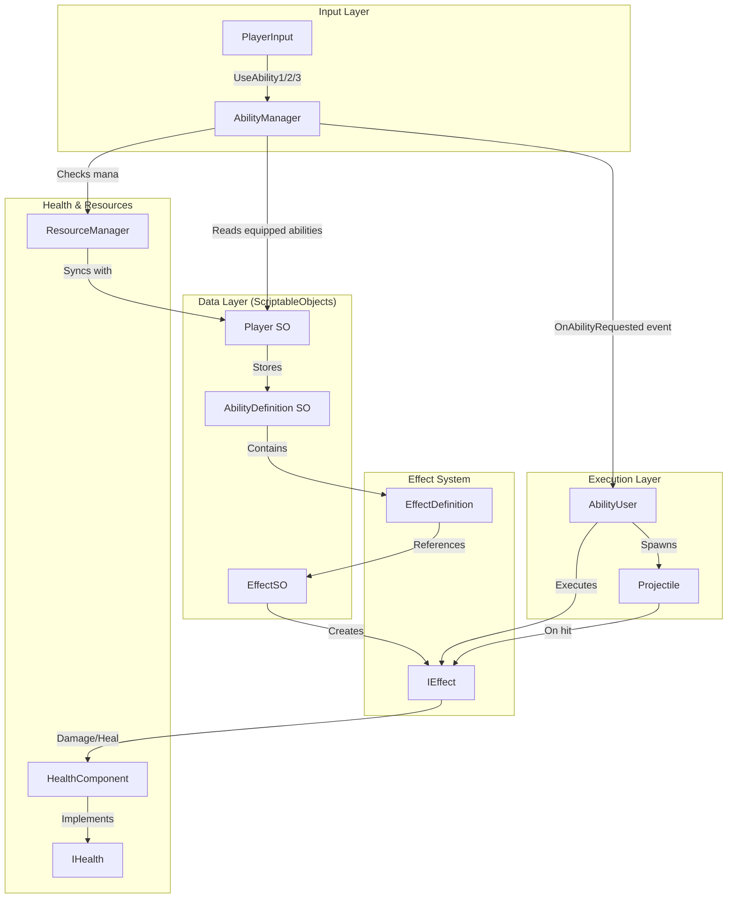
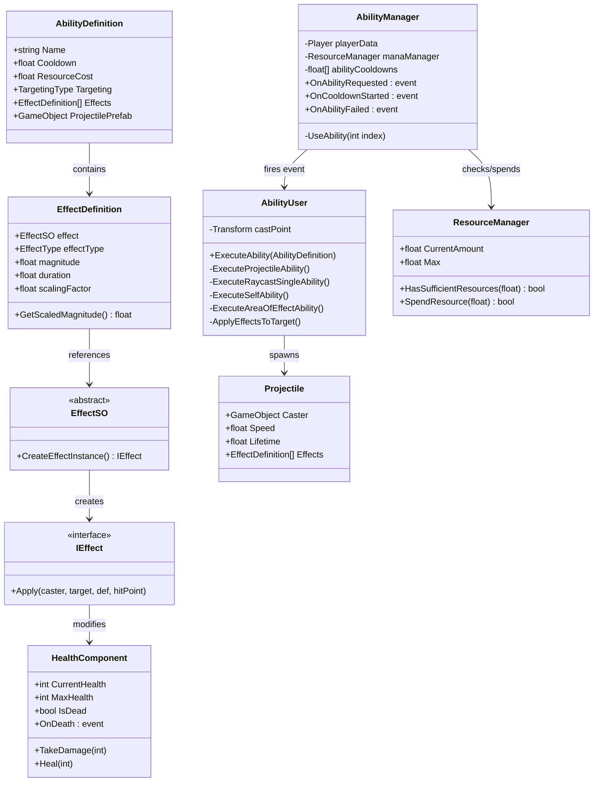
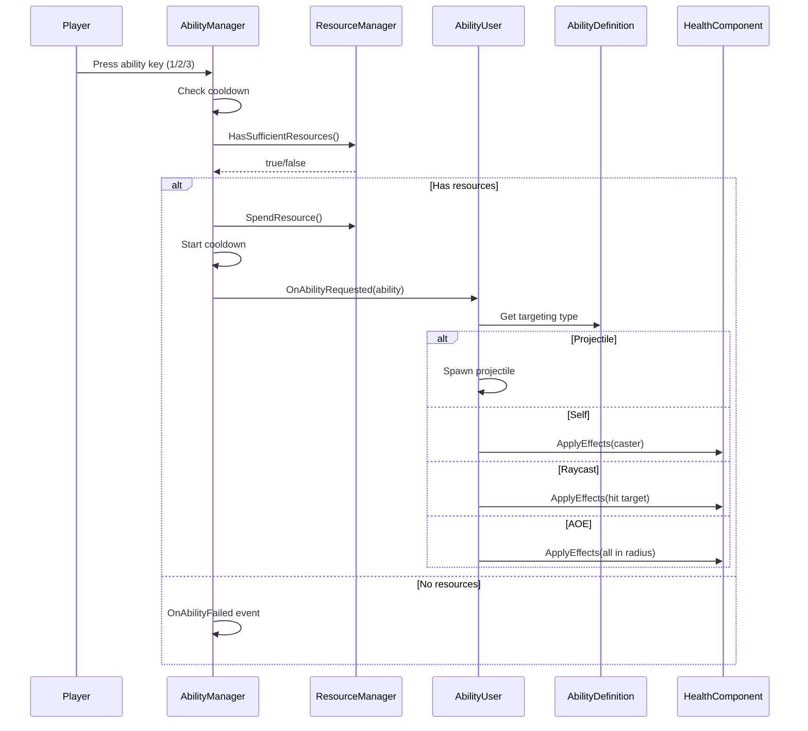

# Abilities System

A flexible, event-driven abilities system for Unity that supports various targeting types, effects, and resource management.

---

## Architecture Diagram



---

## Component Relationships



---

## Event Flow



---

## Core Components

| Component | Responsibility |
|-----------|----------------|
| `AbilityManager` | Input handling, cooldowns, mana validation, fires events |
| `AbilityUser` | Executes abilities based on targeting type |
| `AbilityDefinition` | ScriptableObject defining ability properties |
| `EffectSO` | Abstract base for effect ScriptableObjects |
| `EffectDefinition` | Serializable effect parameters (magnitude, duration, etc.) |
| `IEffect` | Interface for runtime effect execution |
| `HealthComponent` | Health management, damage, healing, death |
| `ResourceManager` | Mana/resource management with regeneration |
| `Projectile` | Runtime projectile movement and collision |
| `Player` | ScriptableObject storing equipped abilities and stats |

---

## Targeting Types

| Type | Execution Method | Description |
|------|------------------|-------------|
| `Self` | `ExecuteSelfAbility()` | Applies effects to caster |
| `Projectile` | `ExecuteProjectileAbility()` | Spawns traveling projectile |
| `RaycastSingle` | `ExecuteRaycastSingleAbility()` | Instant hit via raycast |
| `AreaOfEffect` | `ExecuteAreaOfEffectAbility()` | Hits all in radius |

---

## Effect Types

| Type | Description |
|------|-------------|
| `Damage` | Reduces target health |
| `Heal` | Restores target health |
| `Buff` | Positive status effect |
| `Debuff` | Negative status effect |

---

## File Structure

```
Assets/Scripts/Abilities/
??? AbilityManager.cs       # Input, cooldowns, events
??? AbilityUser.cs          # Ability execution
??? AbilityDefinition.cs    # Ability SO + TargetingType enum
??? EffectSO.cs             # Abstract effect base
??? EffectDefinition.cs     # Effect parameters
??? EffectType.cs           # Effect type enum
??? IEffect.cs              # Effect interface
??? HealthComponent.cs      # Health + IHealth interface
??? ResourceManager.cs      # Resource management
??? Projectile.cs           # Projectile behavior
```

---

## Quick Reference

### Creating an Ability
1. Create `AbilityDefinition` asset
2. Set targeting type, cooldown, mana cost
3. Add effects via `EffectDefinition` array
4. Assign to `Player` SO's equipped abilities

### Creating a Custom Effect
1. Extend `EffectSO` ? implement `CreateEffectInstance()`
2. Create class implementing `IEffect` ? implement `Apply()`
3. Create SO asset, assign to ability's effects